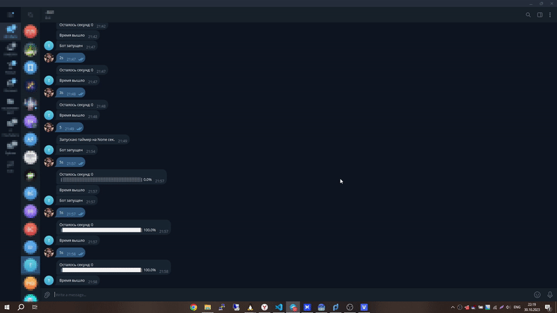

<a name="readme-top"></a>

# Telegram Second Counter

<details>
<summary><h2>Table of Contents</h2></summary>

  - [Overview](#overview)
  - [Features](#features)
  - [Installation](#installation)
  - [Usage](#usage)
  - [Project objectives](#project-objectives)
  - [License](#license)
</details>

## Overview

**Telegram Timer Bot** is a utility designed to create a countdown timer right within a Telegram chat. Using a simple textual interface, users can set timers, and the bot notifies them about the progress with a visual progress bar and also sends a notification when the time runs out.

<p align="right">(<a href="#readme-top">back to top</a>)</p>

## Features

- **Visual Progress Indicator:** with the `render_progressbar` function, users get a graphical representation of the remaining time.
- **Real-time Notifications:** the `notify_progress` function updates the timer message in the chat, providing the current progress and sends a message when the time is up.
- **Pytimeparse Integration:** allows users to set time in various formats, e.g., "2h15m" or "90s".
- **Modularity and Clean Code:** functions like `start_notify_progress` and `notify_progress` ensure clarity and ease of code perception.
- **Integration with ptbot library:** for convenient interaction with the Telegram API.
- **Environment Variable Usage:** secure API key storage using `dotenv`.

<p align="right">(<a href="#readme-top">back to top</a>)</p>

## Installation

To install Telegram Second Counter, follow these steps:

### 1. 🐍 Environment setup

First of all, make sure you have Python 3 installed, version `3.8.0` or higher. If not, visit the [official Python website](https://www.python.org/) and download the latest version.

The command to check your Python version should show a version no lower than `3.5.0`. You might need to use aliases such as `python`, `py`, `python3.8`, or onwards up to `python3.12` instead of `python3`.

```
$ python --version
Python 3.8.10
```

### 2. 📥 Repository cloning

Clone the repository using the command below:

```
git clone https://github.com/WarLikeLaux/telegram-second-counter
```

Then, navigate to the project folder:

```
cd telegram-second-counter
```

### 3. 🧩 Dependencies installation

Use pip (or pip3, if there's a conflict with Python2) to install the dependencies:

```
pip install -r requirements.txt
```

### 4. 🗝️ Environment variables setup

To set up your environment variables, you'll need to create a `.env` file in the root directory of the project. If you already have a `.env.example` file, you can simply copy with rename it to `.env` using the command `cp .env.example .env`. Once you've done this, add or/and fill the following lines by values in your `.env` file:

- `TELEGRAM_TOKEN` - it's your Telegram bot token. If you're unsure, find more info at the article ["Get access token to connect Telegram bot"](https://helpdesk.bitrix24.com/open/17622486/).

Please ensure that each environment variable is assigned the correct value.

<p align="right">(<a href="#readme-top">back to top</a>)</p>

## Usage

To use Telegram Second Counter, follow these steps:

**1. Run the bot:**
```
python main.py
```

Once started, the bot becomes interactive within Telegram. You can set a timer by sending a message. The message format for the timer can be in hours and minutes (e.g., "2h15m") or in seconds (e.g., "90s"). This will initiate the countdown based on the time you've set.



<p align="right">(<a href="#readme-top">back to top</a>)</p>

## Project objectives

This code was written for educational purposes as part of an online course for web developers at [dvmn.org](https://dvmn.org/).

<p align="right">(<a href="#readme-top">back to top</a>)</p>

## License

This code is open-source and free for any modifications, distributions, and uses. Feel free to utilize it in any manner you see fit.

<p align="right">(<a href="#readme-top">back to top</a>)</p>